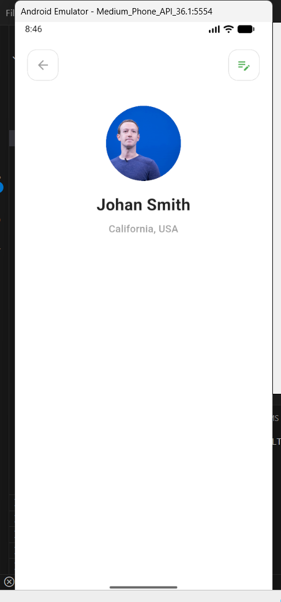

# Bài Tập Tuần 1 - Lập trình thiết bị di động

---

## Mô tả bài tập

Bài tập tuần 1 tập trung vào việc định hướng tư duy về ngành lập trình di động và thực hành xây dựng giao diện người dùng (UI) cơ bản sử dụng Flutter Framework.

**Mục tiêu:**

- Xác định mục tiêu học tập và tầm nhìn về ngành.
- Làm quen với các Widget cơ bản trong Flutter: `Scaffold`, `Column`, `Row`, `Container`, `CircleAvatar`.
- Xây dựng màn hình Profile cá nhân theo thiết kế mẫu.

---

## Phần 1: Trả lời câu hỏi định hướng

### 1. Mong muốn và định hướng của bạn là gì sau khi học xong môn học là gì?

### 2. Theo bạn, trong tương lai gần (10 năm) lập trình di động có phát triển không? Giải thích tại sao?

---

## Phần 2: Thực hành UI (Profile Screen)

### 1. Cấu trúc Source Code

Code được viết trong file `main.dart`, bao gồm các thành phần chính:

- **`MyApp`**: Widget gốc khởi tạo ứng dụng, tắt banner debug.
- **`ProfileScreen`**: Widget chính chứa giao diện người dùng.
  - **`SafeArea`**: Đảm bảo nội dung không bị che khuất bởi tai thỏ hoặc thanh trạng thái.
  - **`Column`**: Sắp xếp các phần tử theo chiều dọc (Nút bấm -> Avatar -> Tên -> Địa chỉ).
  - **`Row`**: Sắp xếp 2 nút bấm (Back và Edit) nằm ngang ở hai bên màn hình (`MainAxisAlignment.spaceBetween`).
  - **`Container` & `BoxDecoration`**: Tạo khung viền bo tròn cho các nút bấm.
  - **`CircleAvatar`**: Hiển thị ảnh đại diện từ đường dẫn mạng (`NetworkImage`).

### 2. Kết quả đầu ra (Output)

