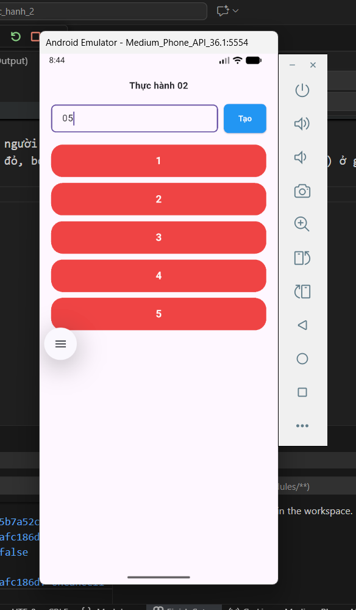

# Bài tập: Thực hành 2

## 1. Mô tả bài tập

Xây dựng ứng dụng Flutter đơn giản cho phép người dùng nhập vào một con số.

- Nếu nhập đúng số: Tạo ra một danh sách các ô màu đỏ tương ứng với số lượng đã nhập.
- Nếu nhập sai (chữ, ký tự đặc biệt) hoặc để trống: Hiển thị thông báo lỗi "Dữ liệu bạn nhập không hợp lệ".

## 2. Mục tiêu và Kết quả đạt được

### a. Mục tiêu

- Rèn luyện kỹ năng xây dựng giao diện cơ bản (Layout) với `Row`, `Column`, `Expanded`.
- Hiểu cách lấy dữ liệu từ người dùng thông qua `TextField` và `TextEditingController`.
- Thực hành tư duy logic lập trình: Kiểm tra tính hợp lệ của dữ liệu (Validate).
- Làm quen với `ListView.builder` để hiển thị danh sách dữ liệu động.

### b. Kết quả đạt được

- Đã hoàn thiện giao diện giống với yêu cầu thiết kế (đã loại bỏ AppBar mặc định, sử dụng SafeArea).
- Chức năng hoạt động ổn định:
  - Bắt lỗi tốt khi người dùng nhập sai định dạng.
  - Hiển thị đúng số lượng phần tử khi nhập số hợp lệ.
- Code được tổ chức rõ ràng, tách biệt phần giao diện và logic xử lý.

## 3. Giải thích các hàm quan trọng

### a. Hàm `_handleTaoDanhSach()`

Đây là hàm xử lý chính khi nhấn nút "Tạo":

- **B1:** Lấy dữ liệu từ ô input.
- **B2:** Dùng `int.tryParse()` để kiểm tra xem dữ liệu có phải là số không.
- **B3:**
  - Nếu lỗi (null hoặc số âm): Gán biến lỗi để hiện thông báo đỏ.
  - Nếu đúng: Xóa lỗi và cập nhật biến đếm số lượng.
- **B4:** Gọi `setState()` để vẽ lại màn hình theo dữ liệu mới.

### b. Widget `ListView.builder`

Dùng để vẽ danh sách các ô màu đỏ:

- `itemCount`: Số lượng phần tử (lấy từ số người dùng nhập).
- `itemBuilder`: Vẽ từng ô `Container` màu đỏ, bo tròn góc và hiển thị số thứ tự (index + 1) ở giữa.

## 4. Hình ảnh đầu ra (Output)

