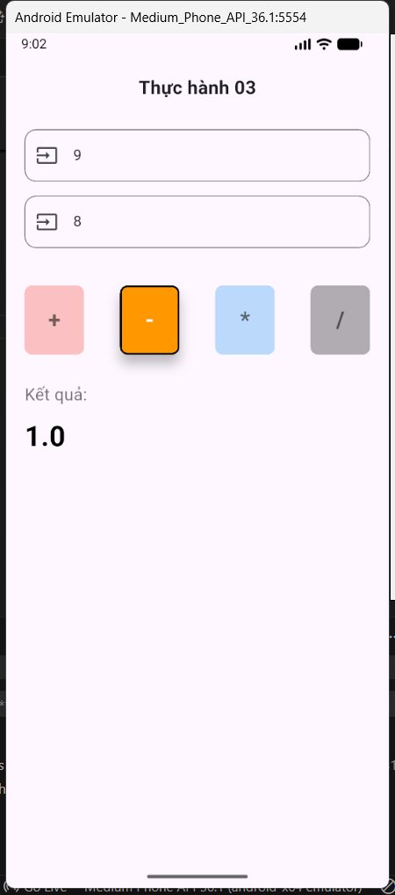

# Bài tập thực hành 3

## 1. Mô tả bài tập

Xây dựng ứng dụng máy tính cơ bản cho phép nhập 2 số và thực hiện các phép tính (+, -, \*, /).

- **Tính năng nâng cao:** Khi chọn phép tính nào, nút đó sẽ sáng lên và có viền bao quanh, các nút còn lại sẽ mờ đi để người dùng dễ nhận biết.

## 2. Mục tiêu và Kết quả đạt được

### a. Mục tiêu

- Luyện tập kỹ năng xử lý form nhập liệu (`TextField`).
- Quản lý trạng thái (`State`) để thay đổi giao diện tức thì.
- **Tư duy UI/UX:** Tạo hiệu ứng phản hồi thị giác (Visual Feedback) khi người dùng tương tác với nút bấm.

### b. Kết quả đạt được

- Giao diện đẹp, bố cục rõ ràng, code sạch sẽ.
- Chức năng tính toán chính xác, có bắt lỗi nhập liệu và lỗi chia cho 0.
- **Hiệu ứng nút bấm:** Đã làm được chức năng highlight (nổi bật) phép toán đang chọn và làm mờ các phép toán còn lại.

## 3. Giải thích các hàm quan trọng

### a. Hàm `_calculate(String operation)`

Xử lý logic tính toán:

1.  Lưu phép toán vừa nhấn vào biến `_selectedOperation` để phục vụ việc đổi màu nút.
2.  Kiểm tra dữ liệu đầu vào (Validate): Báo lỗi nếu để trống hoặc chia cho 0.
3.  Thực hiện phép tính và cập nhật kết quả qua `setState()`.

### b. Hàm `_buildButton(String label, Color color)`

Hàm này chịu trách nhiệm vẽ nút và xử lý hiệu ứng highlight:

- Kiểm tra xem nút này có đang được chọn hay không (`isSelected`).
- **Xử lý màu sắc:**
  - Nếu **được chọn**: Giữ nguyên màu gốc, thêm viền đen (`BorderSide`) và đổ bóng (`elevation`).
  - Nếu **không chọn**: Làm mờ màu đi bằng `color.withOpacity(0.3)` để nút chìm xuống.

## 4. Hình ảnh đầu ra (Output)

