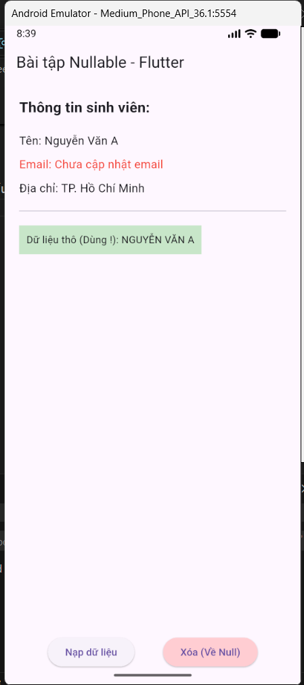

# Bài Tập Tuần 3 - Bài thực hành 1 - Lập trình thiết bị di động

---

## Mô tả bài tập

Bài tập tuần 3 tập trung vào việc tìm hiểu và áp dụng **Null Safety** trong ngôn ngữ Dart và Flutter Framework. Đây là tính năng quan trọng giúp giảm thiểu lỗi crash ứng dụng do biến nhận giá trị `null`.

**Mục tiêu:**

- Hiểu khái niệm Nullable và Non-nullable trong Dart.
- Phân biệt khi nào nên và không nên sử dụng Nullable.
- Nắm vững các toán tử xử lý null: `?`, `?.`, `??`, `!`.
- Xây dựng màn hình ví dụ áp dụng các kiến thức trên.

---

## Phần 1: Trả lời câu hỏi lý thuyết (Tìm hiểu về Nullable)

### 1. Thế nào là Nullable?

Trong Dart (với Sound Null Safety), các biến mặc định là **Non-nullable** (không thể chứa giá trị `null`).

- **Nullable** là loại biến được phép chứa giá trị `null` bên cạnh kiểu dữ liệu gốc của nó.
- **Ký hiệu:** Thêm dấu `?` sau kiểu dữ liệu.
  - Ví dụ: `String` (Không được null) vs `String?` (Có thể null).

### 2. Khi nào nên / không nên dùng?

- **Nên dùng (Nullable):**

  - Khi biến có thể chưa có giá trị tại thời điểm khởi tạo (ví dụ: chờ load API).
  - Khi dữ liệu là tùy chọn (Option), người dùng có thể nhập hoặc không (ví dụ: trường Email, Sở thích).
  - Khi hàm cần trả về trạng thái "không tìm thấy" kết quả.

- **Không nên dùng (Non-nullable):**
  - Các dữ liệu cốt lõi bắt buộc phải có để ứng dụng chạy (ví dụ: ID, Context).
  - Giúp code an toàn hơn, tránh việc phải kiểm tra `if (variable != null)` ở khắp mọi nơi.

### 3. Cách thức xử lý null phổ biến (Dart Syntax)

Dưới đây là các toán tử trong Dart tương ứng với yêu cầu bài tập:

- **`?` (Nullable Declaration):** Dùng khi khai báo biến.
  - _Ví dụ:_ `int? age;`
- **`?.` (Safe Call):** Truy cập thuộc tính an toàn. Nếu đối tượng null, trả về null thay vì báo lỗi.
  - _Ví dụ:_ `user?.name`
- **`??` (Null Coalescing):** (Tương ứng `?:` trong bài tập). Nếu giá trị bên trái null, lấy giá trị mặc định bên phải.
  - _Ví dụ:_ `name ?? "No Name"`
- **Kiểm tra dòng chảy (Flow Analysis):** (Tương ứng `let` trong bài tập). Dùng `if` để đảm bảo biến không null trong phạm vi đó.
  - _Ví dụ:_ `if (user != null) { print(user.name); }`
- **`!` (Null Assertion):** (Tương ứng `!!` trong bài tập). Ép kiểu khẳng định biến không null. Sẽ gây lỗi nếu biến thực sự là null.
  - _Ví dụ:_ `user!.name`

---

## Phần 2: Thực hành UI (Nullable Example Screen)

### 1. Cấu trúc Source Code

Code được viết trong file `main.dart`, bao gồm các thành phần chính:

- **`Student` Model**:
  - Class mô phỏng đối tượng sinh viên.
  - Sử dụng kết hợp `String` (tên bắt buộc) và `String?` (email, địa chỉ tùy chọn) để minh họa.
- **`NullableExampleScreen`**:
  - **`State`**: Quản lý biến `Student? currentStudent` có thể thay đổi giữa trạng thái `null` và có dữ liệu.
  - **`Column`**: Sắp xếp các thông tin hiển thị dọc.
  - **`Text` Widgets**:
    - Minh họa toán tử `?.`: `currentStudent?.name`.
    - Minh họa toán tử `??`: `currentStudent?.email ?? "Chưa cập nhật"`.
  - **`ElevatedButton`**:
    - Nút "Nạp dữ liệu": Khởi tạo đối tượng Student.
    - Nút "Xóa": Gán `currentStudent = null` để test giao diện khi không có dữ liệu.

### 2. Kết quả đầu ra (Output)

Ứng dụng hiển thị thông tin sinh viên, xử lý an toàn các trường hợp dữ liệu bị thiếu mà không gây crash ứng dụng.

