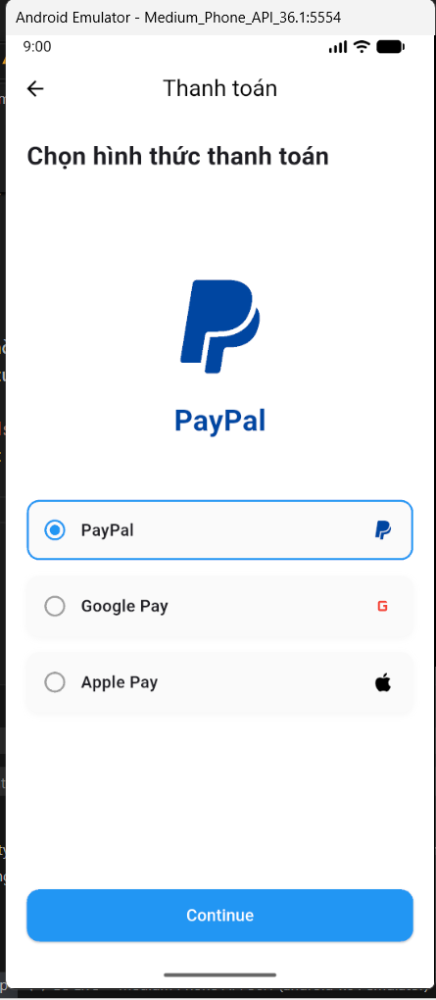

# Bài Tập Tuần 3 - bài tập thực hành 2 - Lập trình thiết bị di động

---

## Mô tả bài tập

Bài tập tuần 3 - bài tập thực hành 2 tập trung vào tư duy lập trình Hướng đối tượng (OOP) để quản lý dữ liệu và xử lý trạng thái (State) trong Flutter, cụ thể là tính năng chọn phương thức thanh toán.

**Mục tiêu:**

- Áp dụng OOP: Xây dựng Class đại diện cho đối tượng thanh toán thay vì code cứng giao diện.
- Xử lý Null Safety: Quản lý trạng thái khi chưa chọn (null) và đã chọn.
- Sử dụng `StatefulWidget` và `setState` để cập nhật UI tức thời.
- Thiết kế giao diện danh sách động (Dynamic List) từ dữ liệu.

---

## Phần 1: Phân tích kỹ thuật (Áp dụng OOP)

### 1. Tại sao cần áp dụng OOP trong bài toán này?

Thay vì viết lặp đi lặp lại 3 lần mã nguồn cho 3 nút (PayPal, GooglePay, ApplePay), việc áp dụng OOP giúp code gọn gàng và dễ mở rộng. Ta tạo ra một bản thiết kế (Class) chung và quản lý các phương thức thanh toán trong một danh sách (`List`).

### 2. Mô hình hóa dữ liệu (Data Modeling)

Tạo một class `PaymentMethod` bao gồm các thuộc tính:

- `id`: Định danh duy nhất.
- `name`: Tên phương thức hiển thị.
- `icon`: Logo của phương thức.
- `color`: Màu sắc đặc trưng cho giao diện.

---

## Phần 2: Thực hành UI (Payment Selection Screen)

### 1. Cấu trúc Source Code

Code được viết trong file `main.dart`, bao gồm các thành phần chính:

- **`PaymentMethod` Class**: Định nghĩa cấu trúc dữ liệu cho các đối tượng thanh toán.
- **`PaymentScreen` (StatefulWidget)**: Màn hình chính xử lý logic.
  - **Biến trạng thái `_selectedMethod`**:
    - Kiểu dữ liệu `PaymentMethod?` (Nullable).
    - Mặc định là `null` (tương ứng với trạng thái chưa chọn).
  - **`_buildDisplayArea` (Logic hiển thị)**:
    - Nếu `_selectedMethod == null`: Hiển thị icon ví rỗng và thông báo chờ.
    - Nếu `_selectedMethod != null`: Hiển thị Logo to và tên phương thức tương ứng.
  - **`Column` & `.map()`**:
    - Sử dụng hàm `.map()` để duyệt qua danh sách đối tượng `paymentMethods` và sinh ra các widget nút bấm tự động.
  - **`InkWell` / `GestureDetector`**: Bắt sự kiện người dùng chạm vào nút để kích hoạt hàm `setState`.

### 2. Kết quả đầu ra (Output)

