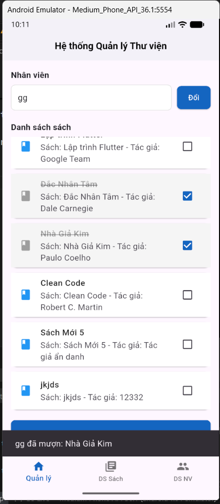
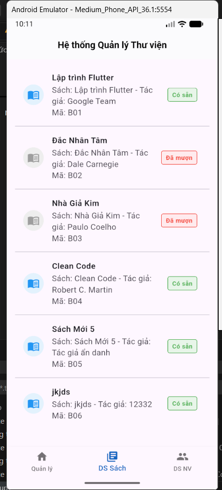
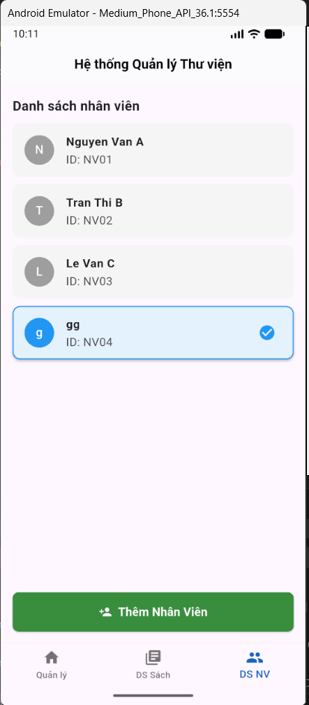

# Bài Tập Tuần 3 - sbài tập thực hành 3- Lập trình thiết bị di động

---

## Mô tả bài tập

Bài tập tuần 3 - bài tập thực hành 3 tập trung vào việc áp dụng các nguyên lý **Lập trình hướng đối tượng (OOP)** vào thực tế xây dựng ứng dụng Flutter. Ứng dụng là một hệ thống "Quản lý Thư viện" cho phép quản lý sách, nhân viên và trạng thái mượn trả.

**Mục tiêu:**

- Áp dụng triệt để 4 tính chất OOP: Trừu tượng, Kế thừa, Đóng gói, Đa hình.
- Sử dụng `StatefulWidget` để quản lý dữ liệu động.
- Xây dựng giao diện điều hướng bằng `BottomNavigationBar`.
- Xử lý các tác vụ: Thêm sách, Thêm nhân viên, Đổi người dùng, Mượn/Trả sách.

---

## Phần 1: Phân tích kỹ thuật (Áp dụng OOP)

Source code được thiết kế dựa trên kiến trúc OOP để đảm bảo tính mở rộng và bảo mật dữ liệu:

### 1. Tính Trừu tượng (Abstraction)

- **Class `LibraryItem`**: Là lớp trừu tượng định nghĩa khung sườn chung cho các tài liệu (gồm ID, Title, trạng thái mượn).
- Các phương thức như `getDetails()` được khai báo trừu tượng, buộc các lớp con phải tự định nghĩa nội dung chi tiết.

### 2. Tính Đóng gói (Encapsulation)

- Các thuộc tính quan trọng như `_id`, `_title`, `_isBorrowed` được đặt là **Private** (bắt đầu bằng dấu `_`) để ngăn chặn truy cập trực tiếp từ bên ngoài.
- Dữ liệu chỉ được truy xuất thông qua các **Getter**.
- Logic thay đổi trạng thái mượn/trả được đóng gói gọn trong hàm `toggleBorrowStatus()`.

### 3. Tính Kế thừa (Inheritance)

- **Class `Book` extends `LibraryItem`**: Lớp Sách kế thừa toàn bộ thuộc tính của lớp cha, giúp tái sử dụng mã nguồn và chỉ cần bổ sung thêm thuộc tính riêng là `_author`.

### 4. Tính Đa hình (Polymorphism)

- Phương thức `getDetails()` được **Override** (ghi đè) trong class `Book` để hiển thị thông tin đặc thù của sách (Tác giả), khác với các loại tài liệu khác (nếu có trong tương lai).

---

## Phần 2: Thực hành UI & Chức năng

### 1. Cấu trúc Source Code

Code trong file `main.dart` được chia thành các thành phần Widget rõ ràng:

- **`MyApp`**: Cấu hình Theme chung (Font chữ Inter, Size 15.68px) và khởi chạy ứng dụng.
- **`LibraryHomeScreen`**: Màn hình chính chứa logic quản lý State và `BottomNavigationBar`.

  - Quản lý danh sách `libraryItems` (Sách) và `userList` (Nhân viên).
  - Xử lý logic `_handleBorrow`, `_showAddBookDialog`, `_showAddUserDialog`.

- **Các Tab màn hình con:**
  1.  **`ManagementTab` (Quản lý):** Dashboard chính. Cho phép xem nhân viên đang trực, đổi nhân viên và thực hiện checkbox mượn/trả sách.
  2.  **`BookListTab` (DS Sách):** Hiển thị danh sách sách chi tiết với trạng thái (Có sẵn/Đã mượn) trực quan.
  3.  **`UserListTab` (DS Nhân viên):** Hiển thị danh sách nhân viên, đánh dấu nhân viên đang chọn và nút **Thêm nhân viên mới**.

### 2. Các chức năng chính

- **Mượn/Trả sách:** Click vào checkbox hoặc item để đổi trạng thái, hiển thị thông báo SnackBar ("Nguyễn Văn A đã mượn...").
- **Thêm Sách/Nhân viên:** Sử dụng `AlertDialog` để nhập thông tin và cập nhật vào danh sách ngay lập tức.
- **Đổi Nhân viên:** Chọn nhân viên làm việc từ danh sách người dùng.

### 3. Kết quả đầu ra (Output)

