# Bài tập thực hành tuần 4 : Tổng hợp các thành phần UI cơ bản trong Flutter

## 1. Mô tả ứng dụng

Đây là ứng dụng demo tổng hợp các thành phần giao diện (UI Components) cơ bản nhất trong Flutter. Mục tiêu của ứng dụng là tái hiện các thành phần UI (tương tự như trong Jetpack Compose) để hiểu rõ cách thức hoạt động, cách bố cục và xử lý sự kiện trong Flutter.

Ứng dụng bao gồm màn hình chào mừng, danh sách menu điều hướng và 7 màn hình chi tiết minh họa cho từng nhóm widget.

## 2. Cấu trúc và Tính năng

Ứng dụng được chia thành các màn hình (Screen) cụ thể như sau:

### a. Màn hình chính

- **WelcomeScreen:** Màn hình giới thiệu với Logo Flutter và nút "I'm Ready" để bắt đầu.
- **ComponentListScreen:** Menu danh sách sử dụng `ListView` và `ListTile`, cho phép điều hướng đến các màn hình chi tiết.

### b. Nhóm Hiển thị (Display)

- **TextDetailScreen:**
  - Minh họa kỹ thuật hiển thị văn bản nâng cao.
  - Sử dụng `RichText` và `TextSpan` để định dạng từng từ trong một câu (gạch ngang chữ "quick", tô màu cam chữ "Brown", in nghiêng, gạch chân...).
- **ImageDetailScreen:**
  - Hiển thị ảnh từ Internet (`NetworkImage`).
  - Sử dụng `ClipRRect` để bo tròn góc ảnh.
  - Sử dụng `CircleAvatar` để hiển thị ảnh đại diện hình tròn.

### c. Nhóm Nhập liệu (Input & Interaction)

- **InputDetailScreen:**
  - **TextField thường:** Có viền (`OutlineInputBorder`), icon và nhãn. Xử lý sự kiện `onChanged` để hiển thị dữ liệu nhập tức thời (Real-time).
  - **TextField mật khẩu:** Sử dụng thuộc tính `obscureText: true` để che ký tự.
- **ButtonDetailScreen:**
  - **Action Buttons:** `ElevatedButton`, `OutlinedButton`.
  - **Selection Controls:**
    - `Checkbox`: Chọn đa luồng (Checked/Unchecked).
    - `Switch`: Công tắc bật/tắt (On/Off).
    - `Radio Button`: Chọn 1 trong nhiều (Nam/Nữ) sử dụng `groupValue`.

### d. Nhóm Bố cục (Layout)

- **LayoutDetailScreen:**
  - **Row:** Sắp xếp các khối màu theo chiều ngang (có hỗ trợ cuộn ngang với `SingleChildScrollView`).
  - **Column:** Sắp xếp các khối màu theo chiều dọc.
- **StackDetailScreen:**
  - Minh họa widget `Stack` để xếp chồng các phần tử lên nhau (Layering). Ví dụ: Text nằm đè lên hộp vàng, hộp vàng đè lên hộp đỏ.

### e. Các Widget mở rộng (More Basics)

- **MoreWidgetsScreen:**
  - **Slider:** Thanh trượt chọn giá trị số.
  - **Icons:** Sử dụng bộ icon có sẵn của Material Design.
  - **Container:** Demo trang trí hộp nâng cao với `BoxDecoration` (màu nền, bo góc, viền đỏ, đổ bóng `BoxShadow`).
  - **Feedback:** Demo hiển thị thông báo bằng `SnackBar` (dưới đáy màn hình) và `AlertDialog` (cửa sổ bật lên).
  - **Drawer:** Thanh menu trượt từ cạnh trái màn hình.

## 3. Kỹ thuật lập trình áp dụng

### Quản lý trạng thái (State Management)

Sử dụng `StatefulWidget` và hàm `setState()` cho các màn hình cần cập nhật giao diện khi người dùng tương tác:

- Cập nhật văn bản khi gõ phím trong `TextField`.
- Cập nhật trạng thái `true/false` của Checkbox và Switch.
- Cập nhật giá trị index của Radio Button.
- Cập nhật giá trị số thực của Slider.

### Điều hướng (Navigation)

Sử dụng `Navigator` để chuyển đổi giữa các màn hình:

```dart
Navigator.push(context, MaterialPageRoute(builder: (context) => ScreenName()));
```

## 4. Hình ảnh đầu ra (Output)

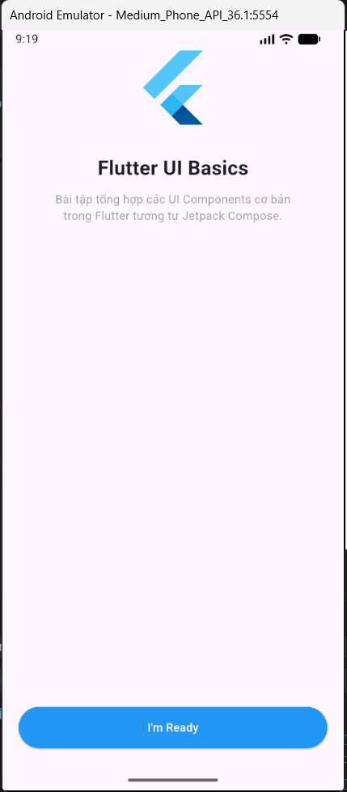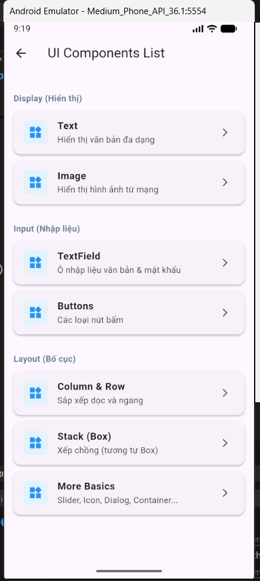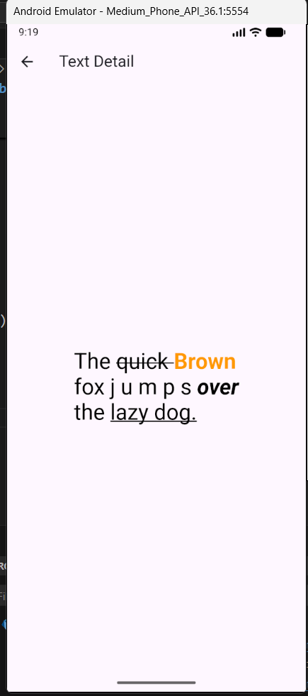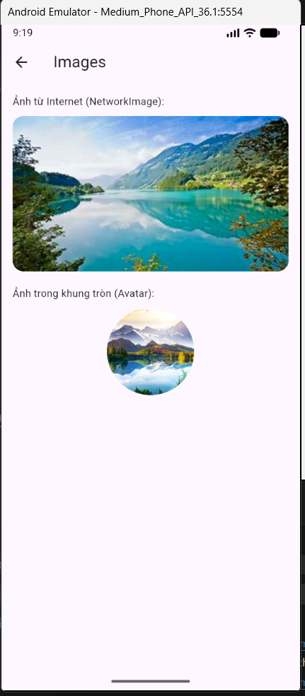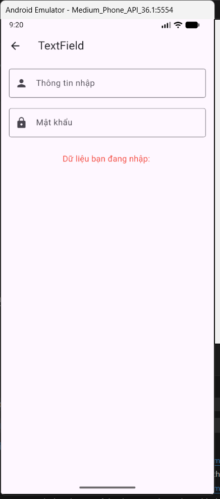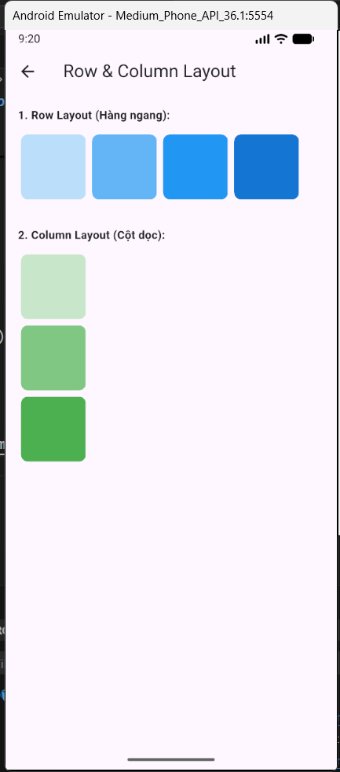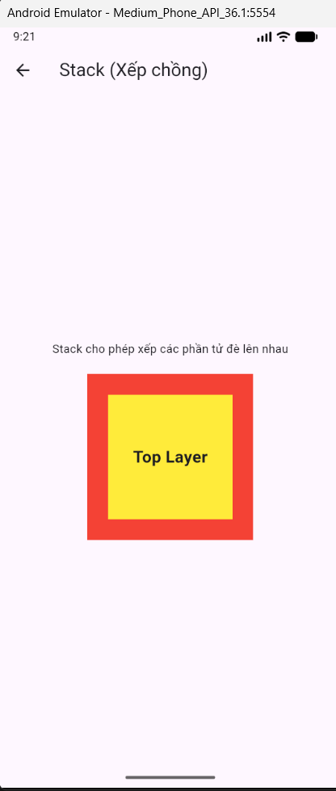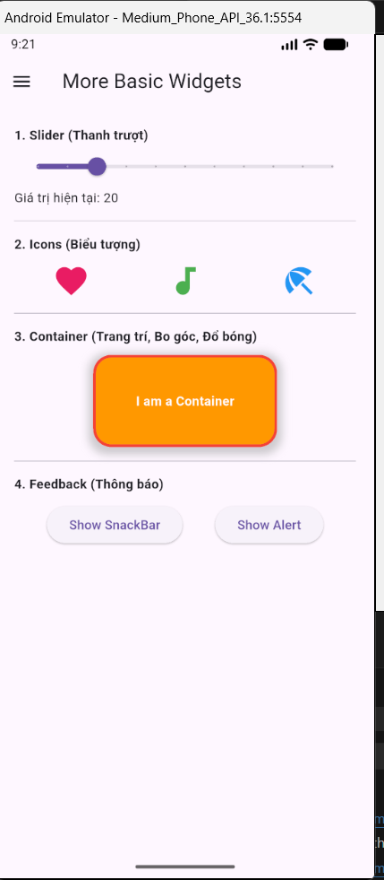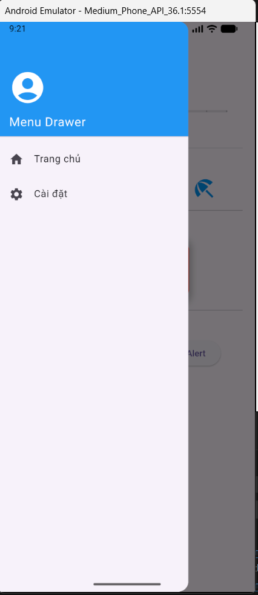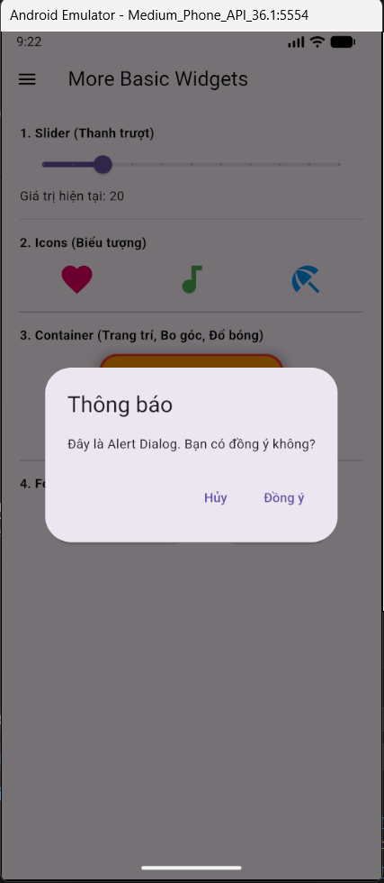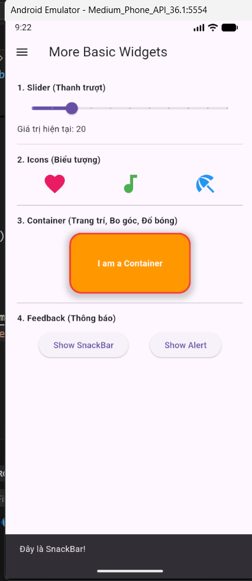
