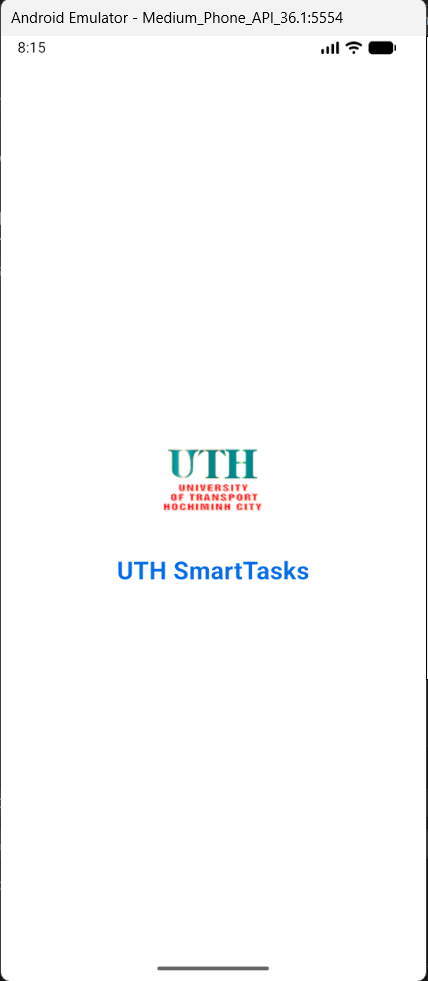
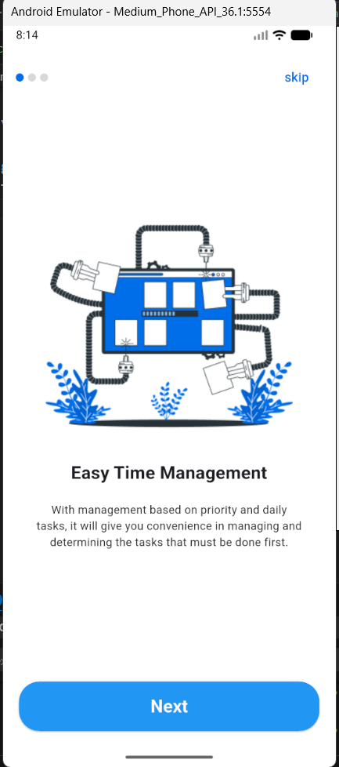
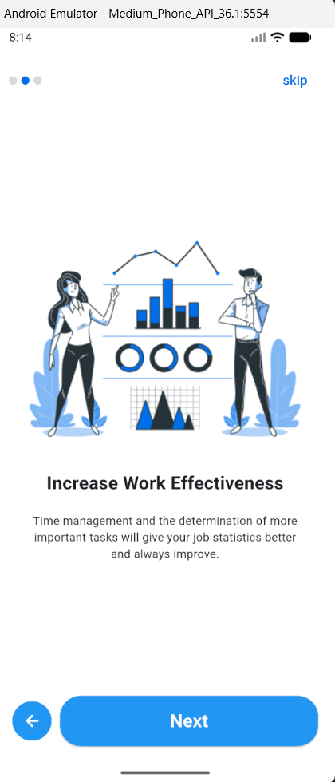

Bài tập về nhà TUẦN 5_01: Thực hành Navigation & OOP (UTH SmartTasks)

1. Mô tả ứng dụng
   UTH SmartTasks là ứng dụng demo mô phỏng quy trình giới thiệu người dùng (Onboarding Flow) cho một ứng dụng quản lý công việc. Mục tiêu chính của bài tập là áp dụng Lập trình hướng đối tượng (OOP) để quản lý dữ liệu hiển thị và thực hành kỹ thuật Điều hướng (Navigation) giữa các màn hình trong Flutter.

Ứng dụng bao gồm màn hình chờ (Splash Screen) tự động chuyển hướng và màn hình hướng dẫn (Onboarding Screen) với các tương tác trượt, chuyển trang mượt mà.

2. Cấu trúc và Tính năng
   Ứng dụng được chia thành các màn hình và lớp dữ liệu cụ thể như sau:

a. Mô hình dữ liệu (Data Model - OOP)
Class OnboardingContent: - Được định nghĩa trong file onboarding_content.dart.

Sử dụng constructor để khởi tạo các thuộc tính: image, title, description.

Tạo một danh sách List<OnboardingContent> tĩnh chứa nội dung của 3 trang giới thiệu (Easy Time Management, Increase Work Effectiveness, Reminder Notification).

b. Màn hình Chờ (Splash Screen)
Giao diện: Hiển thị Logo trường (UTH), tên ứng dụng "UTH SmartTasks" với màu chủ đạo xanh dương.

Logic: Sử dụng Timer để đếm ngược 3 giây, sau đó thực hiện điều hướng sang màn hình Onboarding.

c. Màn hình Hướng dẫn (Onboarding Screen)
PageView: Hiển thị nội dung trượt ngang linh hoạt dựa trên danh sách dữ liệu đã tạo.

Dots Indicator: Thanh chỉ dẫn trạng thái trang hiện tại (Active/Inactive dots).

Điều hướng & Tương tác:

Nút Skip: Cho phép nhảy đến trang cuối cùng ngay lập tức (Ẩn đi khi đã ở trang cuối).

Nút Back: Quay lại trang trước đó (Chỉ hiện khi không phải trang đầu tiên).

Nút Next / Get Started: Thay đổi văn bản và chức năng dựa trên vị trí trang (Chuyển trang tiếp theo hoặc Hoàn tất).

Hiệu ứng: Sử dụng Visibility để ẩn/hiện các nút một cách mượt mà mà không làm vỡ layout.

3. Kỹ thuật lập trình áp dụng
   Lập trình hướng đối tượng (OOP)
   Tách biệt phần dữ liệu và giao diện. Thay vì code cứng (hard-code) văn bản vào UI, ứng dụng sử dụng class OnboardingContent để ánh xạ dữ liệu. Điều này giúp dễ dàng thêm, sửa hoặc xóa các trang hướng dẫn mà không cần sửa đổi logic giao diện.

Quản lý trạng thái (State Management)
Sử dụng StatefulWidget và PageController để kiểm soát giao diện:

Theo dõi biến currentIndex để cập nhật màu sắc của Dots indicator.

Cập nhật trạng thái hiển thị của nút "Back" và "Skip".

Thay đổi nhãn nút từ "Next" sang "Get Started" ở trang cuối.

Điều hướng (Navigation)
PushReplacement: Sử dụng tại Splash Screen để chuyển sang Onboarding Screen. Phương thức này thay thế hoàn toàn màn hình Splash trong ngăn xếp (Stack), giúp người dùng không thể nhấn nút "Back" của điện thoại để quay lại màn hình chờ.

Dart

Navigator.pushReplacement(context, MaterialPageRoute(...));

PageController Navigation: Sử dụng animateToPage, nextPage, previousPage để điều khiển việc trượt trang bằng code (khi nhấn nút). 4. Hình ảnh đầu ra (Output)

