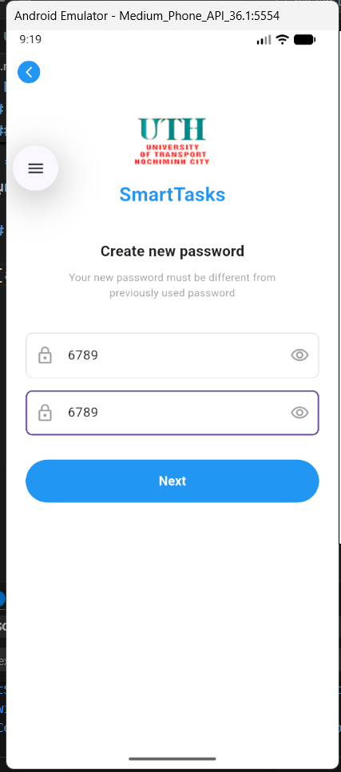
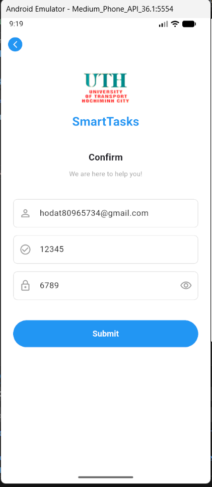

# Bài tập Tuần 5_02: Data Flow & Navigation (UTH SmartTasks)

## 1. Mô tả dự án

**UTH SmartTasks - Reset Password Module** là bài tập thực hành xây dựng chức năng "Quên mật khẩu" (Forgot Password). Mục tiêu chính của bài tập này không chỉ là xây dựng giao diện (UI) mà là xử lý **Luồng dữ liệu (Data Flow)** giữa các màn hình.

Ứng dụng mô phỏng quy trình người dùng nhập Email, nhận mã OTP, tạo mật khẩu mới và xem lại toàn bộ thông tin đã nhập ở màn hình cuối cùng. Dữ liệu được truyền xuyên suốt qua 4 màn hình liên tiếp.

## 2. Luồng đi của ứng dụng (Screen Flow)

Dưới đây là sơ đồ các màn hình và dữ liệu được truyền đi:

1.  **Forget Password Screen:** Người dùng nhập `Email`.
2.  **Verify Code Screen:** Nhập mã OTP (5 số). Nhận `Email` từ màn hình trước.
3.  **Create New Password Screen:** Nhập mật khẩu mới. Nhận `Email` + `Code` từ màn hình trước.
4.  **Confirm Screen:** Hiển thị lại `Email`, `Code`, và `Password` vừa tạo để xác nhận.

## 3. Chi tiết kỹ thuật & Tính năng

### a. Màn hình Quên mật khẩu (`ForgetPasswordScreen`)

- **Chức năng:** Nhập địa chỉ Email.
- **Logic:** Lấy dữ liệu từ `TextField`, khi nhấn "Next" sẽ điều hướng sang màn hình Verify và truyền tham số `email` đi.

### b. Màn hình Xác thực (`VerifyCodeScreen`)

- **UI Nâng cao:**
  - Sử dụng 5 ô nhập liệu (`TextField`) riêng biệt cho từng số.
  - Tự động chuyển tiêu điểm (Focus) sang ô tiếp theo khi nhập số.
  - Tự động lùi lại ô trước khi nhấn xóa (Backspace).
  - Chỉ cho phép nhập số (`FilteringTextInputFormatter.digitsOnly`).
- **Data Flow:** Nhận `email` từ màn hình trước, gom 5 số thành 1 chuỗi `code` và truyền (`email`, `code`) sang màn hình tiếp theo.

### c. Màn hình Tạo mật khẩu mới (`CreateNewPasswordScreen`)

- **Chức năng:** Nhập mật khẩu và xác nhận mật khẩu.
- **Tiện ích UI:**
  - Nút "Mắt" (Visibility Icon) để ẩn/hiện mật khẩu.
  - Kiểm tra mật khẩu xác nhận có trùng khớp hay không (Validation).
- **Data Flow:** Nhận (`email`, `code`), lấy thêm `password` mới và truyền tất cả (`email`, `code`, `password`) sang màn hình Confirm.

### d. Màn hình Xác nhận (`ConfirmScreen`)

- **Chức năng:** Hiển thị tổng hợp tất cả dữ liệu đã thu thập được từ đầu luồng đến cuối luồng.
- **UI:** Các trường hiển thị dạng `ReadOnly` (Chỉ đọc), nhưng vẫn giữ tính năng ẩn/hiện cho trường Mật khẩu.
- **Logic Navigation:** Khi nhấn "Submit", sử dụng `Navigator.popUntil` để quay về màn hình đầu tiên, reset lại luồng ứng dụng.

## 4. Hình ảnh đầu ra (Output)

|||
