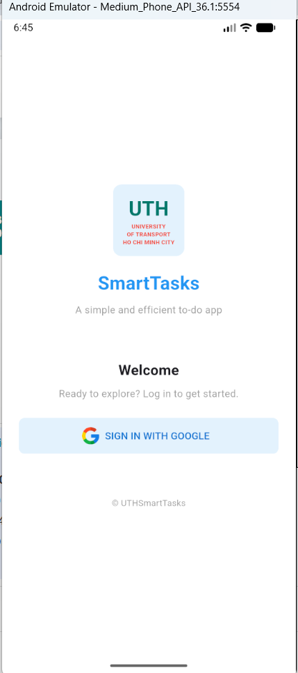
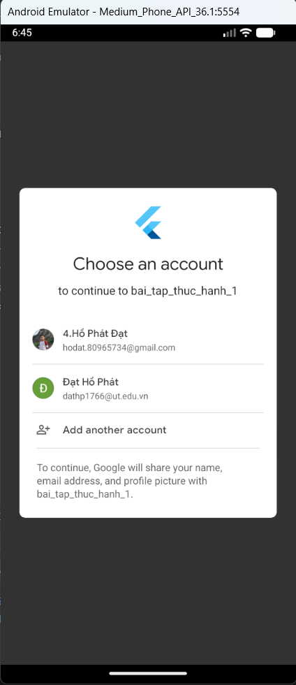
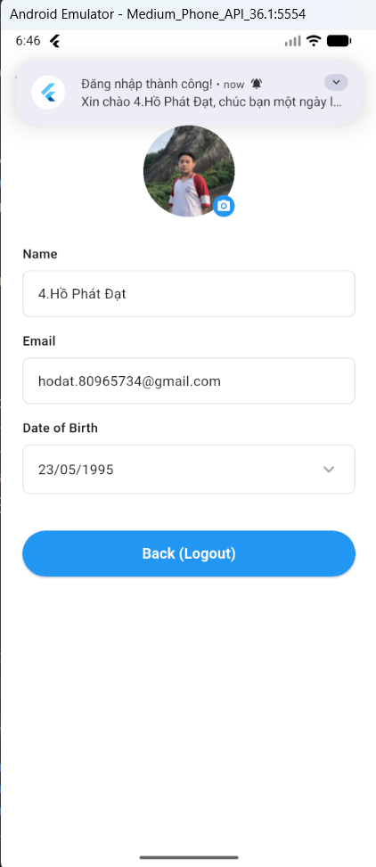

# Bài tập: Google Sign-In & Firebase Services (UTH SmartTasks)

## 1. Mô tả dự án

**UTH SmartTasks - Authentication & Notification Module** là bài tập thực hành tích hợp các dịch vụ của Firebase vào ứng dụng Flutter. Mục tiêu chính của bài tập là xử lý **Xác thực người dùng (Authentication)** thông qua Google và quản lý **Thông báo cục bộ (Local Notifications)**.

Ứng dụng mô phỏng quy trình thực tế: Người dùng đăng nhập bằng tài khoản Google, hệ thống ghi nhận Analytics, tự động gửi thông báo chào mừng và hiển thị thông tin Profile người dùng lấy từ dữ liệu Google.

## 2. Luồng đi của ứng dụng (Screen Flow)

Dưới đây là sơ đồ luồng dữ liệu và tương tác người dùng:

1.  **Login Screen:** Người dùng nhấn nút "Sign in with Google".
2.  **Authentication & Notification:**
    - Hệ thống gọi API Google & Firebase để xác thực.
    - Nếu thành công: Kích hoạt `NotificationService` để bắn thông báo "Đăng nhập thành công" ngay lập tức.
    - Chuyển hướng (Navigate) sang màn hình Profile.
3.  **Profile Screen:** Hiển thị thông tin `DisplayName`, `Email`, `PhotoURL` lấy từ tài khoản Google.
4.  **Logout Action:** Xóa Cache Google Sign-In và Firebase Auth, quay về màn hình Login.

## 3. Chi tiết kỹ thuật & Tính năng

### a. Cấu hình & Dịch vụ nền (`Main` & `NotificationService`)

- **Firebase Analytics:**
  - Tích hợp `FirebaseAnalyticsObserver` trong `main.dart` để theo dõi hành vi điều hướng của người dùng.
- **Notification Service:**
  - Thiết kế theo mẫu **Singleton** (chỉ khởi tạo 1 lần duy nhất trong suốt vòng đời app).
  - Kết hợp `flutter_local_notifications` và `firebase_messaging`.
  - **Chức năng:** Hiển thị thông báo dạng Pop-up (Heads-up) ngay khi người dùng đăng nhập thành công.

### b. Màn hình Đăng nhập (`LoginScreen`)

- **UI:** Thiết kế logo UTH và bố cục chào mừng thân thiện, chuyên nghiệp.
- **Logic Đăng nhập:**
  - Sử dụng `GoogleSignIn` để lấy `accessToken` và `idToken`.
  - Dùng `GoogleAuthProvider` để xác thực Credential với Firebase.
  - **Điểm nhấn:** Gọi `NotificationService().showLocalNotification()` ngay khi có kết quả `UserCredential` để tăng trải nghiệm người dùng.

### c. Màn hình Thông tin cá nhân (`ProfileScreen`)

- **Chức năng:** Hiển thị chi tiết thông tin người dùng vừa đăng nhập.
- **UI Components:**
  - `CircleAvatar`: Hiển thị ảnh đại diện từ Google (có xử lý fallback icon nếu user không có ảnh).
  - Các trường thông tin (Name, Email, DOB) hiển thị dạng thẻ (Card) gọn gàng.
- **Logic Đăng xuất (Logout):**
  - Xử lý triệt để vấn đề lưu cache tài khoản bằng cách gọi tuần tự:
    1.  `await GoogleSignIn().signOut()` (Xóa cache Google trên thiết bị).
    2.  `await FirebaseAuth.instance.signOut()` (Đăng xuất khỏi Firebase).
  - Sử dụng `pushAndRemoveUntil` để xóa sạch stack màn hình khi quay về Login, ngăn người dùng back lại màn hình cũ.

## 4. Hình ảnh đầu ra (Output)

|            Màn hình 1             |             Màn hình 2              |             Màn hình 3              |
| :-------------------------------: | :---------------------------------: | :---------------------------------: |
|  |  |  |
