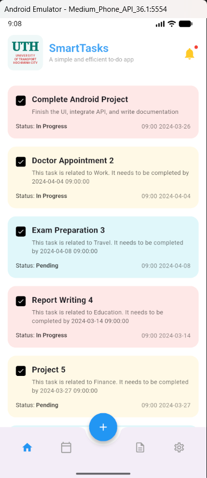
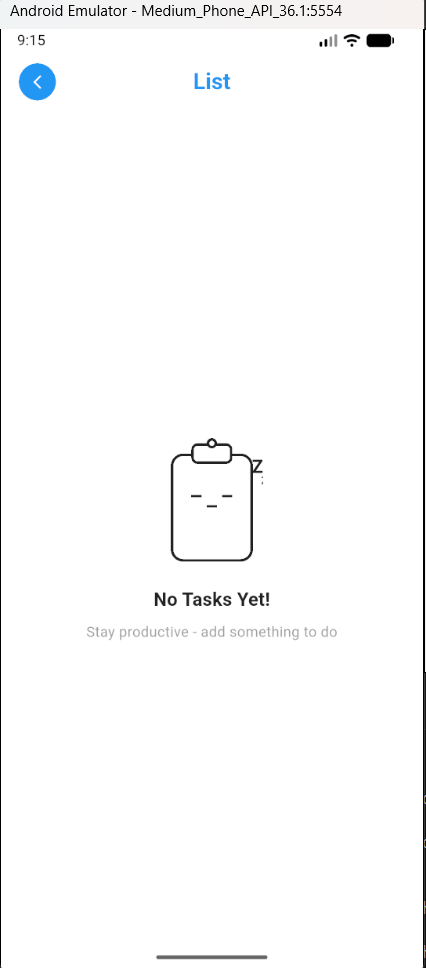
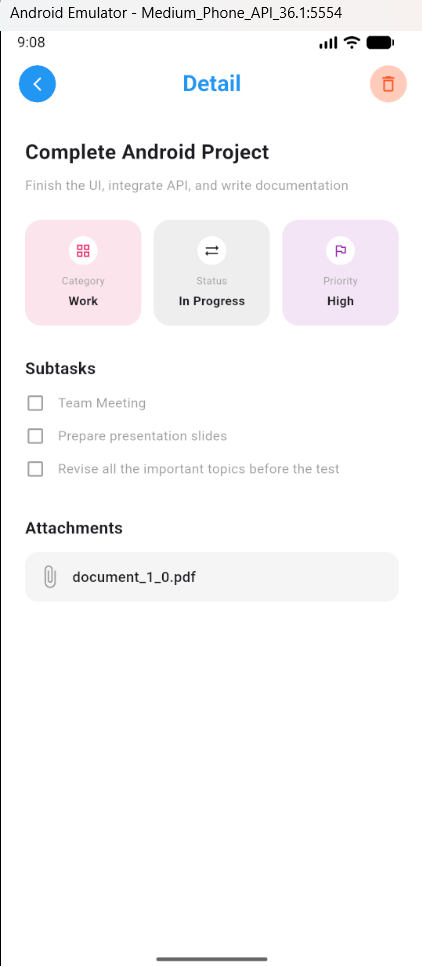

# Bài tập Tuần 07: Xây dựng Flow Trang chủ (UI + API) - UTH SmartTasks

## 1. Mô tả dự án

**UTH SmartTasks - Task Management Module** là bài tập thực hành tiếp theo trong chuỗi phát triển ứng dụng quản lý công việc. Mục tiêu chính của tuần 04 là tích hợp **API (RESTful)** vào giao diện người dùng, xử lý hiển thị danh sách dữ liệu động, các trạng thái giao diện (Loading, Empty, Data) và điều hướng giữa các màn hình.

Ứng dụng sử dụng Mock API để giả lập các thao tác thực tế: Lấy danh sách công việc, Xem chi tiết và Xóa công việc.

## 2. Luồng đi của ứng dụng (Screen Flow)

Dưới đây là sơ đồ luồng dữ liệu và tương tác người dùng:

1.  **Home Screen (Danh sách):**
    - Ngay khi mở ứng dụng, hệ thống gọi API `fetchTasks`.
    - Hiển thị **CircularProgressIndicator** khi đang tải.
    - Nếu danh sách trả về rỗng: Hiển thị giao diện **EmptyView** (Icon Clipboard ngủ).
    - Nếu có dữ liệu: Hiển thị danh sách **Task List** với các thẻ màu sắc sinh động.
2.  **Detail Screen (Chi tiết):**
    - Người dùng nhấn vào một thẻ công việc -> Chuyển sang màn hình chi tiết.
    - Gọi API `fetchTaskDetail` (theo ID mô phỏng) để lấy dữ liệu đầy đủ (Subtasks, Attachments...).
3.  **Delete Action (Xóa):**
    - Tại màn hình chi tiết, nhấn nút **Xóa (Delete)** trên AppBar.
    - Gọi API `deleteTask`. Nếu thành công, quay lại màn hình chính và **lập tức xóa item đó khỏi danh sách** để cập nhật giao diện (Optimistic UI update).

## 3. Chi tiết kỹ thuật & Tính năng

### a. Cấu trúc dự án (Simplified Clean Architecture)

Mã nguồn được tổ chức gọn gàng, tách biệt giữa giao diện và logic dữ liệu:

- **`models.dart`**: Chứa các class dữ liệu (`Task`, `TaskDetail`, `SubTask`).
- **`api_service.dart`**: Xử lý toàn bộ các `http request` (GET, DELETE).
- **`home_screen.dart`**: Quản lý trạng thái danh sách (`_tasks`, `_isLoading`) và giao diện trang chủ.
- **`detail_screen.dart`**: Hiển thị thông tin chi tiết và xử lý logic xóa.

### b. Tích hợp API (Mock Data)

Hệ thống kết nối với **amock.io** theo yêu cầu đề bài:

- **GET List:** `https://amock.io/api/researchUTH/tasks`
- **GET Detail:** `https://amock.io/api/researchUTH/task/1` _(Hardcode ID=1 để lấy mẫu dữ liệu)_
- **DELETE:** `https://amock.io/api/researchUTH/task/1` _(Giả lập thao tác xóa)_

### c. Điểm nhấn UI/UX

- **Custom AppBar:** Tự vẽ Logo **UTH** và tiêu đề **SmartTasks** bằng Code (Container & Text) để đảm bảo độ sắc nét và giống thiết kế gốc 100%.
- **Trạng thái linh hoạt:** Xử lý mượt mà các trạng thái: Đang tải -> Có dữ liệu -> Rỗng.
- **Logic xóa cục bộ:** Do Mock API không thực sự xóa dữ liệu trên server, ứng dụng sử dụng kỹ thuật xóa item khỏi mảng `_tasks` ngay tại client (`_tasks.removeWhere`) để đảm bảo trải nghiệm người dùng logic và nhất quán.

## 4. Hình ảnh đầu ra (Output)

| Màn hình Danh sách (Data) |  Màn hình Rỗng (Empty)   | Màn hình Chi tiết (Detail) |
| :-----------------------: | :----------------------: | :------------------------: |
|   |  |    |
